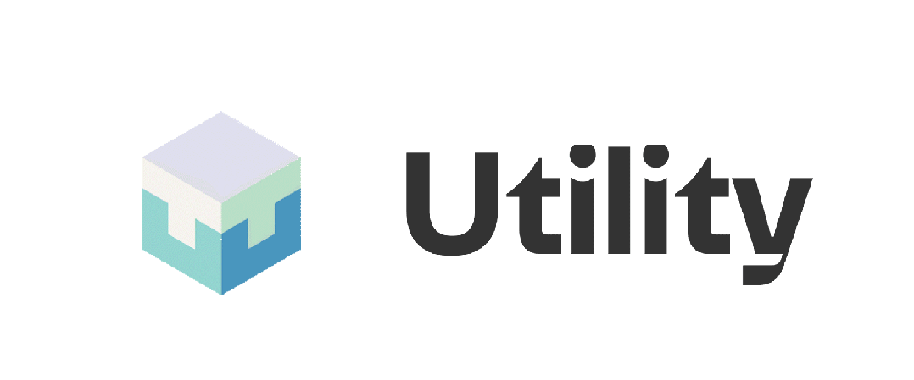

<br />
<br />

<p align="center">

</p>

<br />
<br />


![Stable Status][stable-release]
![Prerelease Status][prerelease]
[![codecov][codecov-badge]][codecov-url]
[![Discord chat][discord-badge]][discord-url]
[![Telegram Group][telegram-badge]][telegram-url]

[stable-release]: https://img.shields.io/github/v/release/utnet-org/utility?label=stable
[prerelease]: https://img.shields.io/github/v/release/utnet-org/utility?include_prereleases&label=prerelease
[codecov-badge]: https://codecov.io/gh/utnet-org/utility/branch/master/graph/badge.svg
[codecov-url]: https://codecov.io/gh/utnet-org/utility
[discord-badge]: https://img.shields.io/discord/490367152054992913.svg
[discord-url]: https://unc.chat
[telegram-badge]: https://cdn.jsdelivr.net/gh/Patrolavia/telegram-badge@8fe3382b3fd3a1c533ba270e608035a27e430c2e/chat.svg
[telegram-url]: https://t.me/cryptounc

## Table of Contents

- [Table of Contents](#table-of-contents)
- [About Utility](#about-utility)
- [Installation](#installation)
- [Directory Structure](#directory-structure)
- [Contributing](#contributing)
- [Security](#security)

## About Utility

Utility's mission is to stimulate community-led innovation for the benefit of people worldwide.

To realize this mission, *Utility* provides a platform where developers and entrepreneurs can build applications that put users back in control of their data and assets. This is a core tenet of the ["Open Web" movement][open-web-url].

A key component of *utnet* is utility, a blockchain-powered unc-infra.tructure for serverless applications and smart contracts. Utility aims to offer the ease-of-use and scalability of modern PaaS like Firebase, but at a fraction of the cost of blockchains like Ethereum.

## Installation

The easiest way to join the network, is by using the `make release` command  or download release binaries, which you can install as follows:

```sh
# testnet node init directly use binaries
unc-node --home ~/.unc  init --chain-id testnet --download-genesis --download-config

# download snapshot data （optional）
## install rclone 1.66.0 or beyond
```sh
# Mac 
$ brew install rclone

# Linux
$ sudo apt install rclone

$ mkdir -p ~/.config/rclone
$ touch ~/.config/rclone/rclone.conf

## rclone config
[unc_cf]
type = s3
provider = Cloudflare
endpoint= https://ec9b597fa02615ca6a0e62b7ff35d0cc.r2.cloudflarestorage.com
access_key_id = 2ff213c3730df215a7cc56e28914092e
secret_access_key = b28609e3869b43339c1267b59cf25aa5deff4097737d3848e1491e0729c3ff6c
acl = public-read

## download data 
$ rclone copy --no-check-certificate unc_cf:unc/latest ./
$ latest=$(cat latest)
$ rclone copy --no-check-certificate --progress --transfers=6  unc_cf:unc/${latest:?}.tar.gz /tmp

## un archive snapshot
tar -zxvf /tmp/${latest:?}.tar.gz -C /tmp  && mv /tmp/${latest:?}/data ~/.unc

## on ～/.unc dir touch file `validator_key.json`  (optional)
{
    "account_id": "miner-addr"
    "public_key":"ed25519:2yMvZrTtjgFMtcpE12G3tdt7KsYKdKE6jufRnz4Yyxw3",
    "private_key":"ed25519:3NVx4sHxBJciEH2wZoMig8YiMx1Q84Ur2RWTd2GQ7JNfWdyDxwwYrUR6XtJR3YcYeWh9NzVEmsnYe2keB97mVExZ"
}

# node run
$ unc-node --home ~/.unc  run
```

To learn how to become validator, checkout [documentation](https://docs.xyz666.org).

## Directory Structure

<pre>
├── <a href="./chain/">chain</a>: Consensus chain interaction utilities.
│ ├── <a href="./chain/chain/">bindings</a>: block chain validate and rocksdb column.
│ ├── <a href="./chain/client/">src</a>: peer node bootstrap.
│ └── <a href="./chain/network/">network</a>: libp2p network discover.
├── <a href="./docs/">docs</a>: Documentation resources, including images and diagrams.
├── <a href="./core/">core</a>: Components for utility primitives.
│ ├── <a href="./core/crypto/">crypto</a>: Crypto libs rsa2048, secp256k1.
│ ├── <a href="./core/primitives/">primitives</a>: Chain relatives base data structure.
│ └── <a href="./core/store/">store</a>: rocksdb store data structure.
├── <a href="./infra/">infra</a>: The Utility instance, including application logic and attestation mechanisms.
│ ├── <a href="./infra/src/">infra</a>: Node initialize for Utility.
│ └── <a href="./infra/tests/">test</a>: Command-line tools and utilities.
├── <a href="./runtime/">runtime</a>: Core libraries for various protocol functionalities.
│ ├── <a href="./runtime/runtime/">runtime</a>: Chain state apply, contracts executor.
│ └── <a href="./runtime/unc-vm-runner/">runner</a>: Rust bindings for smart contracts.
├── <a href="./node/">node</a>: Node service for chain messages and transactions.
│ └── <a href="./node/src/">node</a>: Application logic for the node service.
├── <a href="./scripts/">scripts</a>: Utility scripts for development and operational tasks.
└── <a href="./integration-test/">test</a>: Testing suite for end-to-end, smoke, and utility testing.
</pre>

## Contributing

For detailed instructions on how to contribute, including our coding standards, testing practices, and how to submit pull requests, please see [the contribution guidelines](CONTRIBUTING.md)

## Security

Please refer to [SECURITY.md](./SECURITY.md).
